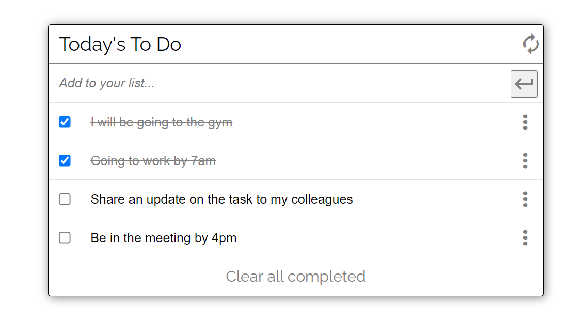

# Advance_todo
> A simple Todo app to add list of books a user has read. It is implemented using HTML, CSS, Webpack, JavaScript and modular architecture. A todo is saved and displayed in Realtime. A todo can be removed from the list of to-dos. Data persistence is implemented using local Storage API.

Additional description about the project and its features.

## Built With

- HTML5
- CSS3
- Webhint
- Stylelint
- Javascript
- Webpack

## Live Demo

[Site is live. Visit now!](https://idungstanley.github.io/Advance_todo/dist/)

## Getting Started

To get a local copy up and running follow these simple example steps.

### Prerequisites

- Knowledge on basic html and css
- Text Editor (VScode, Atom, Sublime text, etc)
- Basic knowledge of node.js

### Setup

- clone repository using `git clone`
- git clone `https://github.com/idungstanley/Advance_todo.git`
- cd `Advance_todo`.
- run `npm install`
- run `npm run start` to start webpack dev server

## Author
👤 **Sunday Stanley Idung**
- GitHub: [@idungstanley](https://github.com/idungstanley)
- Twitter: [@idungstanley](https://twitter.com/IdungStanley)
- LinkedIn: [Sunday (idung) Stanley](https://linkedin.com/in/sundaystanley56)

## 🤝 Contributing

Contributions, issues, and feature requests are welcome!

Feel free to check the [issues page](../../issues/).

## Show your support

Give a ⭐️ if you like this project!

## 📝 License

This project is [MIT](./LICENSE) licensed.
